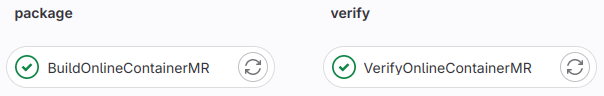

# Description of the stages and jobs in the Cbmroot Merge-Request CI chain

Acronyms:
- MR = Merge Request
- CI = Continuous Integration, checks performed
  - before allowed new changes to be merged to the "official" master
  - as well as immediately after new changes are merged
- Pipeline = one iteration of the CI chain
- Stage = group of jobs inside the pipeline,
  - typically one group starts only after the previous is done
  - and all jobs within the group are running in parallel (provided free runner ressources available)

Frequent troubles:
- for your first MR after creating your fork, said fork needs to be given permissions to start jobs on our runners to
  complete the CI chain. \
  => If you see jobs with a `Pause` icon for longer than 10-15 minutes, stuck or timing out, please check if other MRs
  are running pipelines at the time. If it is not the case please contact @f.uhlig as your fork probably do not have
  the permissions.
- if you delete and re-create your fork, this permissions-setting need to be redone as the system relies on a fork ID
  and not on its name

## 1. Repository check stage


For this stage please also refer to the [information about our workflow in our redmine
wiki](https://redmine.cbm.gsi.de/projects/cbmroot/wiki/GitIntroduction) (added by @f.uhlig).

### Linear History check: `LinearHistCheck`
This check ensures that the proposed commits in the MR doe not introduce a "loop" in the history, typically as a result
 of a `merge commit`. \
`Merge commit` should never appear in our `rebase` base workflow, as the main goal of it is to have a linear history
(single line for the `master` in the
[graph view](https://git.cbm.gsi.de/computing/cbmroot/-/network/master?ref_type=heads)).

Typical solution when this happens with only new commits in one branch and only upstream commits in the other is to do
a rebase on the `upstream/master` and remove the merge commit.
```
git fetch master
git rebase upstream/master
```
if this does not work, one can try an interactive rebase to remove the merge commit
```
# => Check in the graph view or in git log which commit is the merged one
git fetch master
git rebase -i upstream/master
# => your favorite editor will open, just delete the line with the merge commit, save and exit
```

If the loop was introduced between two set of commits not in the master, you will have to be more carefull with the
rebasing in order not to loose some commits.

## 2. Format check stage


### Clang-format check of the code: `CodeFormatCheck`
This test ensures that all new/modified files obey our formatting conventions.

For general information on our conventions, please refer to this [Styleguide page](Styleguide.md).

For information about the valid version of the clang-format tool, installation instructions and usage instructions,
please refer to this [redmine wiki page](https://redmine.cbm.gsi.de/projects/cbmroot/wiki/Clang-format).\
Before/when creating a MR, please format your code either with the "git clang-format" command, with the provided CBM
scripts or by hand, otherwise it will not be merged until fixed.

### File ending check: `FileEndCheck`
This test ensures that all new/modified `text` files have the proper file ending: they should all end with a Linux end
of line: `LF`

You can find the list of affected files in the job logs that you access by clicking on the "red cross icon" or on the
name of the job.

If this happens too often please check the settings of you code editor, it should have some setting similar to `Ensure
new line at file end` (example from `Geany`).

### Line Ending check: `FileFormatCheck`
This test ensures that all new/modified `text` files have only Linux line ending character: only `LF` is allowed. \
`CR/LF` (Windows) and `CR` (MAC) will lead to a failing test.

You can find the list of affected files in the job logs that you access by clicking on the "red cross icon" or on the
name of the job.

If this happens too often please check the settings of you code editor, it should have some setting similar to `Default
end of line characters` (example from `Geany`).


### License check: `FileLicenceCheck`
Our codebase is open source and licensed under the `GPLv3`.\
In addition some rules were agreed upon by the Collaboration Board on how our code should be copyrighted.\
This check ensures that all new/modified files have proper license header fitting the unified format agreed upon.

For more information on how this license header shold look like (for example if the test fails), please refer to the
[corresponding page in our Redmine wiki](https://redmine.cbm.gsi.de/projects/cbmroot/wiki/Licence).

## 3. Build stage


This stage runs the following under various OS and external packages combinations:
- Building the full code under the standard settings
- Running a minimal set of tests
- Trying to install Cbmroot and running a reduced set of tests from the installed version (only on a few combinations)

Detailled results including (limited) logs for each of the test can be found on our
[CDASH server](https://cdash.gsi.de/index.php?project=CbmRoot)

## 4. Online container related stages


These stages build a `Docker` container with only the `online` binaries, register it with our Gitlab instance and check
it.
They are performed in parallel to the `Build` stage as they are fast and are not expected to fail in most cases as long
as the `Build` passes.

## 5. Finalize stage


This stage contains only the `InformCodeOwners` job which will automatically ping in the MR the users declared in the
`CODEOWNERS` file at the root of the repository, if the corresponding files/folders are modified.
This is done to ensure a mininmum of coordination/awareness of changes done to common files.
