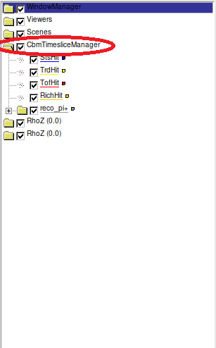
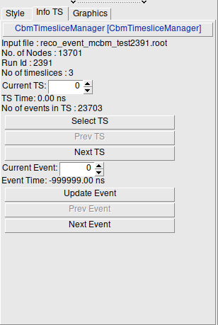
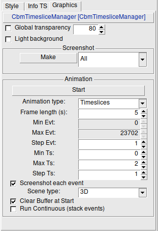
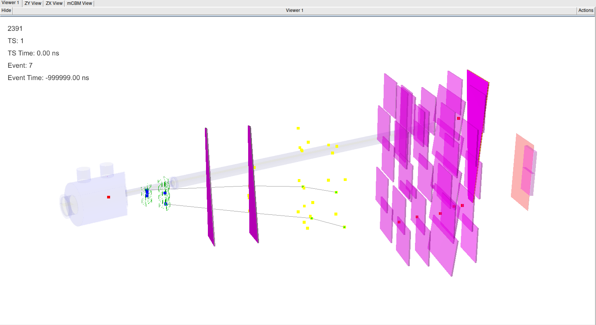
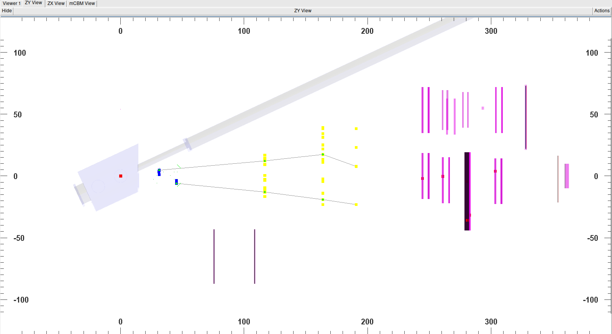
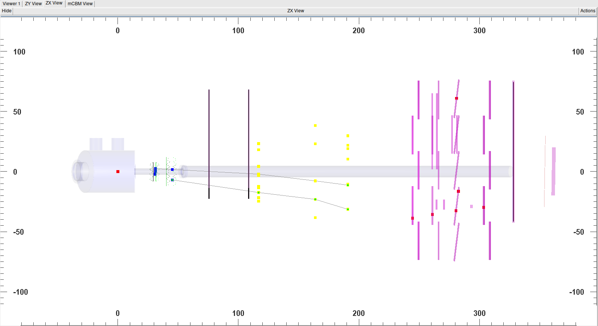
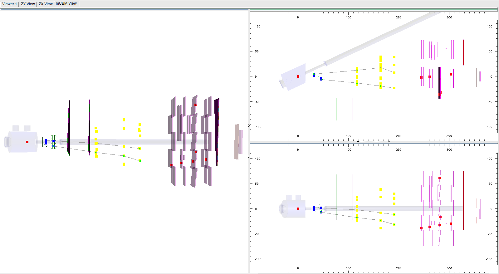

# Event displays

Source files of CBM specific classes are in `core/eventdisplay`

[[_TOC_]]

## Event display for MC data (simulation input and transport)
- Implemented within FairRoot framework thanks to the fact that all our MC data classes inherit from theirs
- Show geometry, MC tracks (GeoTracks) and MC points within
- Compatible with both event based (CbmEvent) and time-based simulations (CbmTimeslice class)

=> Use only classes provided by FairRoot (Mostly developed by D. Wielaniek)

=> Example macro with CBM: `macro/run/eventDisplay.C`

### Typical usage pattern(To be completed by somebody really using it)

1. Pick one of the 2 transport macros in `macro/run` to investigate an MC source, see the CI tests `run_s100e_tra_beam`,
   `run_s100e_tra_coll` and `run_s100e_tra_sign` for examples:
   - `run_tra_beam.C` = propagation of beam particles not having made a collision in the target
   - `run_tra_file.C` = propagation of collision event products (e.g. URQMD input) or of pure signal (e.g. PLUTO input)
1. Add the following line before `run.Run(nEvents);` in the chosen macro, which is needed to enable the storage of the
   MC tracks themselves (independent of the MC points, increases a lot the file size so do it only for reasonnablly low
   number of events):\
   `run.SetStoreTrajectories(kTRUE);`
1. Run the transport simulation
1. Locate the folder where the output files were created. Typically it is simply the `data` subfolder. Needed are the
   `xxxx.geo.root` file and the `xxxx.tra.root` file.
   They need to have the same prefix for the event display to work!
1. Start the event display with the following command:\
   `root -l 'eventDisplay.C("<path to output files>/<xxxx prefix>")'`


## Event display for `direct Event` based (m)CBM Reco tracks (fully event based reconstruction without timeslice)
- Shows the geometry used for the reconstruction, all reconstructed hits, as well as the reconstructed tracks by
  linking the hits belonging to them with line segments and highlighting those when the track is selected.
- Does not display the fitted tracks (curved lines)!
- Allows to select one event in the file
- Allow to make screenshots of this event
- Allow to make "animations", generating screenshots of a selected range of events

=> Using the FairEventManager class of FairRoot with custom handling classes for CBM hits and tracks:
- CbmPixelHitSetDraw
- CbmRecoTracks

=> **Not maintained: no meaningful change since transition to git (>3 years), no Example macro found in current version
of repository**
=> **Not maintained: To be removed at some point?**
=> **If removed probably some work needed on the Timeslice compatible version, as currently using it on the output of
the run_s100e_reco_ev_ideal test give the following fatal error when selecting the first "timeslice" (entry with 1 event
):**
```
CbmTimeslicePixelHitSetDraw::GotoEvent() => Failure, more TofHit in event 0 than available in the TS: 1291 VS 913
```

### Typical usage pattern(To be completed by somebody really using it)
1. Run event base reconstruction, whether on simulated or real data
1. Find somebody who use it and has a macro to share

## Tof Tracking event display (
- Show TOF tracklets and the associated points, weighted either by their time or charge.
- Targeting setups with multiple layers of TOF such as cosmic teststands and maybe early mCBM reco
- Used for example for the CBM-TOF QA with the Heidelberg cosmic-stand
- [Documentation by Jonathan Brandt, 02/10/2018](tof_tracking_event_display.pdf)

=> Using the FairEventManager class of FairRoot with custom handling class for CBM-TOF tracklets:
- CbmEvDisTracks
- CbmPixelHitSetDraw

=> Example macro with mCBM: `macro/mcbm/mcbm_display_event.C`
=> Example macros with TOF cosmic setup: `macro/beamtime/hd2020/dis_trks.C`, `macro/beamtime/hd2020/dis_digi.C`

## Event display for `Event in Timeslice` based (m)CBM Reco Tracks
See also [presentation in Software Meeting on 22/06/2023](https://indico.gsi.de/event/17897/contributions/72491/attachments/44094/62050/loizeau_20230622_EventDisplay_Timeslice_HowTo.pdf)

- Shows the geometry used for the reconstruction, all reconstructed hits, as well as the reconstructed tracks by
  linking the hits belonging to them with line segments and highlighting those when the track is selected.
- **Does not display the fitted tracks (curved lines) for now! Feel free to add this feature!**
- Allows to select a timeslice in the file, go to the next one and go to the previous one
- Auto-loads the first event in any selected TS
- Allows to select an event in the currently selected timeslice, go to the next one and go to the previous one
- Allow to make screenshots of this event
- Allow to make animations displaying the events in a range of events or timeslices, with or without the associated
  generation of screenshots
- Provide 4 auto-generated views with a choice between a CBM and an mCBM mode:
  - In CBM mode: 3D, RPhi and RhoZ views + a combined view of those 3, same as the ones provided by `FairEventManager`
  - in mCBM mode: 3D, ZY and ZX views + a combined view of those 3
- Provide setters to auto-add the proper sets of detector systems for `CBM SIS100 electron`, `CBM SIS100 muon` and `mCBM`
- Configuration of geometry display through XML file over full depth of geometry (Visibility, Transparency, ...) \
  This configuration is bound to a version of the setup as it uses the node names which include the detector geometry
  version

Example macro (tested and validated in version of 23/06/2022)
- with mCBM: `macro/beamtime/mcbm2022/event_display_l1reco.C`, associated with
  `evt_disp_conf_mcbm_beam_2022_05_23_nickel.xml` for run 2391
- with CBM: `macro/run/event_display_reco_ts.C`, associated with `evt_disp_conf_cbm_sis100e.xml` for the sis100e setup

### Typical usage pattern
1. Configure your environment by sourcing the Cbmroot login script
1. Generate the geometry file for your setup, either by running the transport in the case of simulations or by running
   `macro/run/create_mcbm_geo_setup.C` for real data of mCBM 2022 runs (see the `mcbm_geo_2391` CDASH test for an
   example of the call to use)
1. If an alignment file is to be used, locate it (e.g. for mCBM the official ones are placed in `parameters/mcbm`)
1. Perform your reconstruction with L1, for example by using `macro/beamtime/mcbm2022/mcbm_reco.C` (see the
   `mcbm_reco_l1tr_2022_2391` CDASH test for an example of the call to use for mCBM)
1. Locate the ouput file and the eventual `.digi.root` input file
1. Call the event display macro:
   ```
   cd <CBMROOT_PATH>/macro/beamtime/mcbm2022/
   root -l 'event_display_l1reco.C(<RUN ID>, <PATH reco file>, <PATH .geo file>, <PATH  alignment file>, <PATH  optional xml config>, <PATH .digi file)'
   ```
   Replacing:
   - <CBMROOT_PATH> with the path to your CBMROOT source or installation folder (or skipping it if you `cd` to the
     `mcbm2022` folder)
   - <RUN ID> with the index of the run, this can also be set to zero as used only for display purposes
   - <PATH  optional xml config> with the full path (no `~`) to an xml config file, allowing for example to set the
     visibility, transparency or color of any geometry node
   Example:
   ```
   root -l 'event_display_l1reco.C(2391, "data/reco_event_mcbm_test2391.root", "data/mcbm_beam_2022_05_23_nickel.geo.root", "../../../parameters/mcbm/AlignmentMatrices_mcbm_beam_2022_05_23_nickel.root", "evt_disp_conf_mcbm_beam_2022_05_23_nickel.xml", "data/2391_first20Ts.digi.root")'
   ```
1. Wait until the TBrowser with the event display pops-up and fully load. You should then see the setup on a cream
   background.
1. Click on `CbmTimesliceManager` in the left file-browser like tab (see screenshot)\
   
1. This should load the Event display interface, opening 3 new views in the right side and showing the GUI in the bottom
   left corner
1. Click on the `Info TS` tab, then on `Select TS` to load the first event of the first TS
1. You can now browse through the events in the file (cf description of the interface following this)

### Interface description

#### Tab with timeslice and event selection: `Info TS`
- The 4 lines give information on the reco file, the geometry loaded from the geo file and the content of the reco file
- `Current TS` allows to pick a specific TS index within the range available in the reco file (but does not auto-load
  it)
- Once a TS was loaded for the first time, the next line display the start time and number of event of the currently
  selected TS
- `Select TS` allows to load the TS corresponding to the index in `Current TS`.
- `Prev TS` allows to select and load the TS before the current one. It is disabled when the 1st TS is loaded (or none).
- `Next TS` allows to select and load the TS after the current one. It is disabled when the last TS is loaded (or none).
- `Current Event` allows to pick a specific Event index within the range available in the current TS (but does not
  auto-load it)
- Once an event was loaded for the first time, the next line displays its start time within the TS (`TZeroTime`, default
  -999999.00 ns)
- `Select Event` allows to load the Event corresponding to the index in `Current Event`, displaying its tracks and hits.
- `Prev Event` allows to select and load the Event before the current one. It is disabled when the 1st Event is loaded
  or the current TS is empty.
- `Next Event` allows to select and load the TS after the current one. It is disabled when the last Event is loaded the
  current TS is empty.

=> Selecting events in this mode always clears the views and display only a single event!



#### Tab with timeslice and event selection: `Graphics`
- The first two checkboxes are global options applied to all 4 views
  - `Global Transparency` allows to enable and set a single transparency value for all currently visible geo nodes
  - `Light Background` switches between standard (checked, white bkgd) and inverted colors (unchecked, startup default,
    cream bkgd)
- The next group allows to make a screenshot of the selected view. It will pop up a dialog window to select the
  destination filename and type (default `png). The 4 options are:
  - `All`: will generate one picture file for each of the 3 views
  - `ZX` or `ZY` (mCBM mode): will generate a picture files for respectively the ZX or ZY projection view
  - `RPhi` or `RhoZ` (CBM mode): will generate a picture files for respectively the RPhi or RhoZ projection view
  - `3D`: will generate a picture files for the default (main/first) 3D view
- The next group controls the animation feature
  - `Start` starts the animation, which canot be stopped until it is over. Click it only after setting the parameters!
  - `Animation type` allows to select the animation mode
    - `Timeslices` will perform an animation with all event in a range of TS, but obeying the chosen "Event step"
    - `Event by Event` will perform an animation on a chosen range of event within the currently selected TS. In this
      mode the `Start` button is disabled until the first TS is loaded.
  - `Frame Length` allows to pick the duration in second between each event in the animation. Setting it to 0 switches
    between events as fast as the redrawing allows. Recommended values are `0.5 to 10 seconds`
  - `Min Evt` and `Max Evt` event allow to pick the animation range in event by event mode. They are disabled in
    timeslices mode. The limits are set to the number of events in the current TS.
  - `Step Evt` allows to pick the event interval. It is enabled and used in both modes. The maximum limit is set
    relative to the  currently loaded TS, 1 if none is loaded.
  - `Min Ts`, `Max Ts` and `Step Ts` allow to pick the range and stepping of the animation in timeslices mode. They are
    disabled in event by event mode and their limits are set to the number of TS in the reco file.
  - `Screenshot each event` is a checkbox allowing to generate an automatic picture file (`png`) for each event
    displayed in the animation
    - The files are placed in a sub-folder which is newly created if needed:
      - `event_animations` in event by event mode
      - `timeslice_animations` in timeslices mode
    - The file names have the following pattern (each ID is 5 digits 0 filled):
      - `event_<EVENT ID>_<VIEW TYPE>.png` in event by event mode
      - `ts_<TS ID>_event_<EVENT ID>_<VIEW TYPE>.png` in event by event mode
    - One the screenshots type should be selected, picking `All` will generate 3 files for each event
  - `Clear buffer at start` allows to clear the currently displayed hits/tracks before starting the animation. It is
    enabled by default
  - `Run Continuous (stack events)` disabled the clear between events. It allows to stack the hits and track of multiple
    events within the same timeslice. Display is still cleared when changing timeslice.



#### Views








