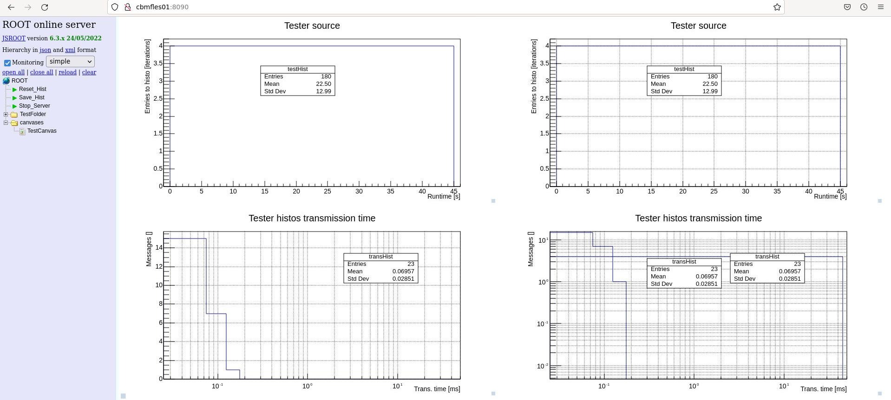

# Histogram servers

Three versions in use until now in CBM:
- Standard server integrated in FairTask run loop and based on Root `HttpServer`
- FairMQ device
- Binary without FairMQ (proof of concept)

## Task based histogram server (FairRoot)

## FairMQ device

**Features:**

**Caveats:**

## Histogram server without FairMQ

[Roadmap](Roadmap.md)

### Proof of concept Format/Protocol

Two message types are allowed:
- Multi-parts message with configuration + histograms (typically "initial" emission)
  1. Header for multi-part message with Configuration + data: for now only numbers of configuration strings for
     histograms and canvases
  1. Configuration strings for some histograms (at best for each of them). **Name duplicates are ignored !!!** \
     If no (new) histograms declared (e.g. new canvas declaration), has to be en empty message + `0` in the header
  1. Configuration strings for canvases ~ Canvases declarations. **Name duplicates are ignored !!!** \
     If no (new) canvas declared (e.g. only histos declaration), has to be en empty message + `0` in the header
  1. Vector of histograms of class `Histo1D`
- Single part message with only vector of histograms of class `Histo1D` (typically "update" emissions)

**=> This means that the expected message sizes are either `1` or `4+ = 1 + N + M + 1`**

------------------

Formats:
- Header: numbers of histogram configs and canvas configs to expect in later parts
  ```
  std::pair< unsigned integer, unsigned integer  > = std::pair< Nb histogram configs, Nb canvas configs  >
  ```
- Histogram configs: for each histogram name, an output folder path used in both the HttpServer and the optional output
  ROOT file
  ```
  std::pair< std::string, std::string > = std::pair< Histo name, Histo output folder>
  ```
- Canvas configs: for each canvas name, a string encoding its full configuration (pads, histograms and draw options)
  ```
  std::pair< std::string, std::string > = std::pair< Canvas name, Canvas config >
  Canvas config = "CanvasName;Canvas Title;NbPadX(U);NbPadY(U);ConfigPad1(s);....;ConfigPadXY(s)"
  PadConfig = "GrixX(b),GridY(b),LogX(b),LogY(b),LogZ(b),(HistoName1,DrawOptions1),...,(HistoNameZ,DrawOptionsZ)"
  ```
  See also [core/base/utils/fles/CbmFlesCanvasTools](
    https://git.cbm.gsi.de/computing/cbmroot/-/blob/master/core/base/utils/flestools/CbmFlesCanvasTools.cxx)
    for the full code, especially GenerateCanvasConfigString \
  (`CanvasConfig` class not used here as library loading would need binding the client to `ROOT` library)
- Vector of histograms
  ```
  std::vector< cbm::algo::Histo1D >
  ```

------------------

Behavior:
- If number of parts at least `4`
  1. From `Part [0]`, extract number of histogram configurations N and canvas configurations M
  1. From `Parts [1] to [1 + N]`, read histogram configurations (one per part) and process them (buffer them in local
     vector)
  1. From `Parts [1 + N + 1] to [1 + N + M]`, read canvas configurations (one per part) and process them (buffer
     them in local vector)
  1. From `Part [1 + N + M + 1]`, extract vector of Histo1D and process them in same way as for single part case (see
     next)
- If number of parts is exactly 1
  1. Extract vector of Histo1D
  1. Loop on the vector and for each
     1. Convert it to `ROOT TH1D`
     1. Check if its name is in the buffer of already received histograms
        - If `NO`:
          1. Store it in buffer (`TObjArray`)
          1. Check if it is already registered with the `HttpServer` and in the negative if a matching config was
             received. If yes, register it, otherwise ignore it. \
             **=> Unregistered histos without config are just buffered but not registered until a config update is
             received!**
        - If `YES`, add it to the already buffered version \
          **Due to this addition, the original histo in the source client should be reset between two emissions,
          except it its X axis is time/time in run!**
  1. For each buffered canvas configuration, check if the corresponding canvas is already ready
     - If `YES`, skip
     - If `NO`:
       1. Convert the config string to `CanvasConfig`
       1. For each pad, check if all corresponding histograms are now available in the buffer
          - If `NO`: skip
          - If `YES`:
            1. Create the Canvas object and divide it as needed
            1. Loop on pads, set their grid/log options and draw all of their histograms
            1. Stove the canvas in buffer
            1. Register it with the `HttpServer`

### Running the server and its tester binary

Current Howto with 2 consoles A and B (eventually adapt ports to local config/firewall):
1. (A & B)
   ```
   cd <build>; source config.sh; cd bin
   ```
1. (A)
   ```
   ./histserv_nofairmq -i tcp://127.0.0.1:56800 -p 8090 -o test_histserv.root -w
   ```
1. (B)
   ```
   ./histserv_nofairmq_tester -o tcp://127.0.0.1:56800 -r 45 -p 2
   ```
1. Browser in local network: `localhost:8090`

Tested on cbmfles01 in folder `/scratch/loizeau/cbmroot/` and during the `Data Challenge #3`



### Adding histogram source client features to a binary `XYZ`

For an example of this, please have a look at `algo/qa/DigiEventQa` and `algo/evbuild/EventbuildChain`

1. Copy the [`Application::PrepareAndSendMsg`](services/histserv/tester/Application.cxx#L146) method from the tester
   binary
1. Copy the `output` argument + related code from the tester binary
   [ProgramOptions](services/histserv/tester/ProgramOptions.h)
1. Copy the `boost::serialization` and `zmq` related include and constructor code from the tester binary `Application``
1. Make sure all histograms in `XYZ` are of class `Histo1D` and stored in a vector (either member variable or local
   variable close to the main execution loop)
1. Add either an initial emission outside of the main loop or a periodic one inside the main loop of the histograms
  config and eventual canvases config, on the model of L.66-99 of the test binary `Application`
1. Add a periodic emission of "histograms updates" followed by a clear if these in the main loop, on the model of
   L.115-122 of the test binary `Application` \
   **Typically to reduce traffic and the cost of the publication, this emission will have a lower frequency than the
   execution of the main loop. For example one could use std::chrono times to emit only every `> n seconds` or emit
   every `N iterations` (or a combination of both as in the FairMQ device implementations).** \
   This timed behavior is present neither in the tester binary (04/10/2023) as it was meant only as a proof of concept
   for the protocol  itself nor in the `DigiEventQa` example as its logic creates new histograms on each iteration.

### Usage with the `cbmreco` binary

1. Start the server exactly as in the tested app example
2. Start `cbmreco` as with `--histogram <address>`
   ```
   ./cbmreco -p <path to algo params> -i <file://path-to-tsa-file or tcp://url-of-ts-server> --steps Unpack DigiTrigger Localreco --histogram <address>
   ```
