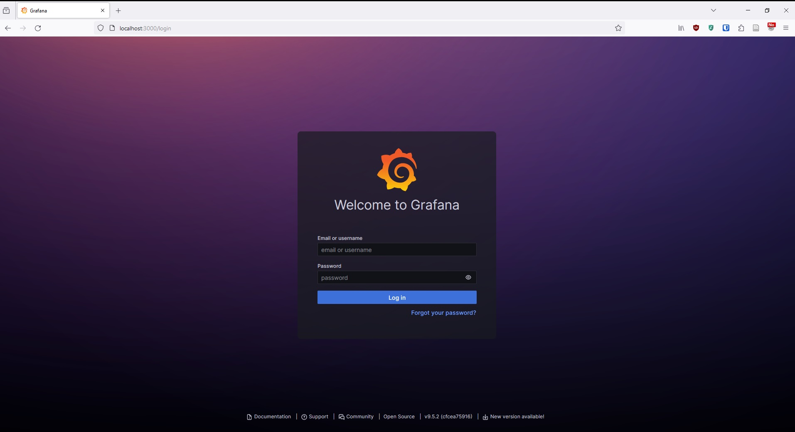
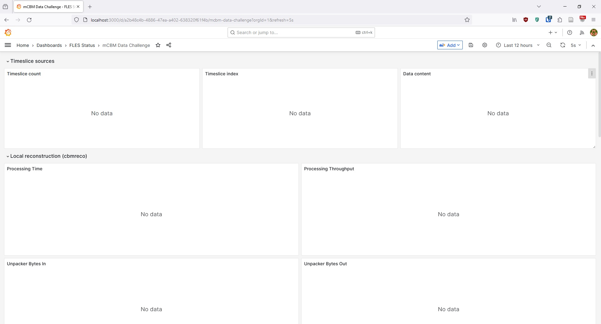
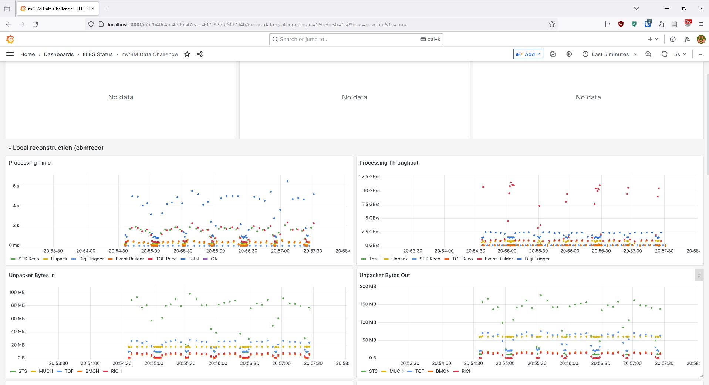
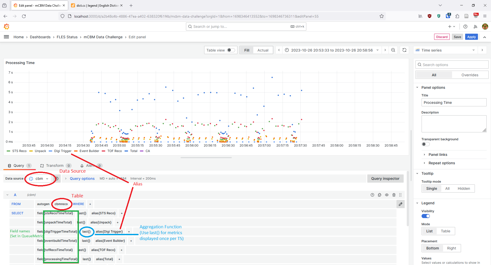
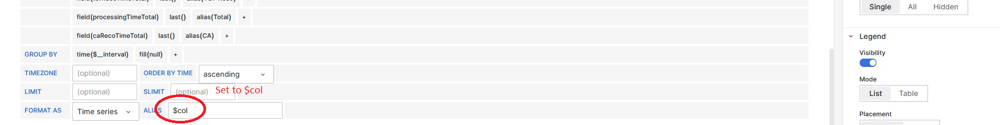

# Monitoring

This page provides an overview on how to add new metrics for monitoring in `cbmreco`. And how to access and edit the Grafana page to plot the new metrics.

## Adding metrics

By convention algorithms should provide monitoring data, alongside the resulting data.
To convert this monitoring data into metrics sent to Influx, pass it along to the `Reco` instance. In `Reco` add a function `Queue<Step>Metrics` that takes the monitoring data as argument and calls the monitor via `GetMonitor`. E.g. for the STS hitfinder this looks like this:
```c++
void Reco::QueueStsRecoMetrics(const sts::HitfinderMonitor& monitor)
{
  if (!HasMonitor()) return;

  GetMonitor().QueueMetric("cbmreco",
    {{"hostname", fles::system::current_hostname()}, {"child", Opts().ChildId()}},
    {
        {"stsRecoTimeTotal", monitor.fTime.wall()},
        {"stsRecoThroughput", monitor.fTime.throughput()},
        {"stsRecoNumClusters", monitor.fNumClusterTotal},
        {"stsRecoNumHits", monitor.fNumHitsTotal},
        {"stsRecoNumClusterBucketOverflow", monitor.fNumClusterBucketOverflow},
        {"stsRecoNumHitBucketOverflow", monitor.fNumHitBucketOverflow},
    });
}
```
Call this function after running the algorithm in `Reco::Run`.

_Note_: The tags `hostname` and `child` have to be created by hand at the moment.

Monitoring data currently has no special requirements. We mostly use plain C structs at the moment. By convention it should contain all information to create the monitoring metrics for the corresponding reconstruction step. E.g. the input or output data isn't required as well to create the metrics. (TODO: Unpacker metrics currently violate this principle!)
The reason for this: so metric creation can be streamlined in the future. E.g. by overloading a function `online::CreateMetrics(MonitorData &)`.

### Local debugging

To debug monitoring locally run with `-m`. These will print all monitoring metrics on stdout, e.g.:
```
$ ./build/bin/cbmreco -p parameters/online -i 2391_node8_0_0001.tsa -m
[...]
cbmreco,hostname=login,child=00 tsIdDelta=684i,unpackTimeTotal=147.651049,unpackThroughput=0.6049629623694716,unpackBytesInSts=9790192i,unpackBytesInMuch=17310400i,unpackBytesInTof=9995728i,unpackBytesInBmon=219360i,unpackBytesInTrd=49623544i,unpackBytesInTrd2d=1012112i,unpackBytesInRich=1372080i,unpackBytesOutSts=11290968i,unpackBytesOutMuch=60095248i,unpackBytesOutTof=21138864i,unpackBytesOutBmon=1224i,unpackBytesOutTrd=33314000i,unpackBytesOutTrd2d=5104i,unpackBytesOutRich=379488i,unpackExpansionFactorSts=1.153293827128212,unpackExpansionFactorMuch=3.471626767723449,unpackExpansionFactorTof=2.114789838218887,unpackExpansionFactorBmon=0.005579868708971553,unpackExpansionFactorTrd=0.6713345584507225,unpackExpansionFactorTrd2d=0.005042920151129519,unpackExpansionFactorRich=0.2765786251530523,unpackExpansionFactorTotal=1.413122131379301,unpackNumCompUsed=0i,unpackNumErrInvalidEqId=0i,unpackNumErrInvalidSysVer=0i 1698351949057091962
cbmreco,hostname=login,child=00 stsNumDigisTotal=1411371i,stsNumDigisInEvents=5765i,stsEvSelectionRatio=0.004084680782019752 1698351949078752865
```

## Grafana

### Connecting to FLES

FLES requires a separate account to the GSI computing account. If you don't have access, ask Dirk Hutter or Jan De Cuveland for FLES account.

Connecting to FLES from outside of GSI and setup the access to Grafana, add to your
`.ssh/config` file:
```
Host fles
    HostName cbmfles01.gsi.de
    User <fles_user>
    ProxyJump gsi
    LocalForward 3000 localhost:3000

Host gsi
    HostName lxlogin.gsi.de
    User <gsi_user>
```

Replace `<fles_user>` with your username on the FLES, and `<gsi_user>` with your GSI username.

Now
```
ssh fles
```
should connect you to the FLES login node.

### Access Grafana

While the ssh connection is active, you can access the Grafana page at `localhost:3000` (Note the local forward in the ssh config):



The login for the default user is:
```
user: <ADD_USERNAME>
password: <ADD_PASSWORD>
```

Once you are logged in you can access the plots:



Plots will likely be empty if no one else is testing and no DC is going on.

The easiest way to test monitoring yourself is to run `cbmreco` on the fles login node.

### Developing / Testing on FLES

To build

```
git clone <your CbmRoot Fork>
cd cbmroot
cmake -S . -B build -DSIMPATH=/scratch/cbmsoft/fairsoft_nov22p1_root6/installation/ -DFAIRROOTPATH=/scratch/cbmsoft/fairroot_v18.8.1-fairsoft_nov22p1_root6

make -sCbuild cbmreco
```

To test you will need a tsa-file. You can find some samples of the two reference runs `2391` and `2488` in `/scratch/mcbm_data/mcbm2022`.
The `nnnn_firstXXX.tsa` files are the ones used for the CI and Nightly/Weekly tests of the offline SW, with consecutive timeslices.
The `2391_node8_[0-5]_0000.tsa` are the first files of run `2391` from each of the 6 disks on one of the two archivers used in 2022, with non-consecutive timeslices (round-robin spread among archivers and disks).

Then run with `-m influx1:localhost:8086:cbm` to write monitoring data to InfluxDB:
```
build/bin/cbmreco -p parameters/online -i /scratch/mcbm_data/mcbm2022/2391_node8_0_0001.tsa -m influx1:localhost:8086:cbm
```
_Note_: From virgo Influx is reachable via `influx1:cbmflesnode0.gsi.de:8086:cbm`.

If you're successful, grafana plots could look something like this:

_Note_: you'll probably want to decrease the time range in the top right corner.

### Add / Modify plots

To add or modify plots you need an admin account. Ask Jan De Cuveland or Dirk Hutter about one.

To add plots, in the top right corner select 'Add -> Visualization'.
Or to modify existing plot, select 'Edit' after clicking on the  three dots '...' in the top right corner.

In new plots:
- select `cbm` as datasource
- select `cbmreco` as table

Then add the fields you want to monitor (Fieldnames correspond to the name set in `QueueMetrics`). For values sent once per timeslice, select `last()` as aggregation function. Generally you'll want to add an alias to field as well. The alias will be displayed in the legend of the plot. Additionally in the bottom set the last field `Alias` to `$col` to remove the table prefix from plot names.

For once-per-timeslice values, additionally usually you'll want to plot points not lines. So select `Points` under `Graph styles` on the right side.

**Don't forget to save your changes. Add a small description of your changes in the save-dialogue.**



